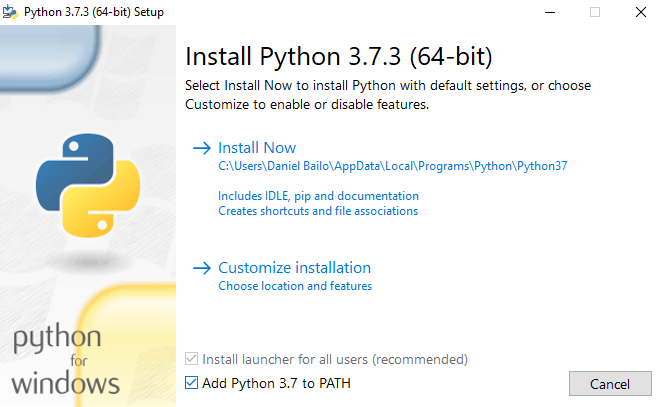
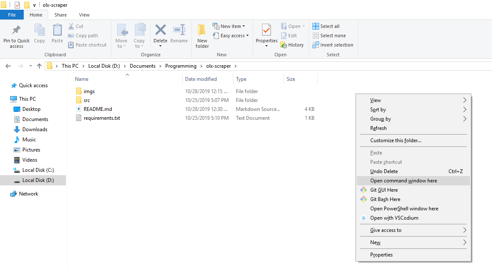

# Scraper OLX

## Descrição
Este projeto consiste em coletar os números de telefone dos usuários que anunciaram determinado produto a partir do link da pesquisa do mesmo e os telefones destes usuários são gravados numa planilha Excel dentro do diretório `output/`.

---
## Requisitos
* `Python - versão 3.7` - [Download](https://www.python.org/ftp/python/3.7.3/python-3.7.3-amd64.exe)
    * Para instalar o Python de forma correta, basta fazer o Download e na tela inicial, marcar o checkbox "Add Python 3.7 to PATH" e clicar em "Install Now"
    
* `pip (Gerenciador de pacotes do Python) ` - o pip já será instalado ao realizar a instalação dessa forma.

---
## Dependências

**OBS: Para abrir uma janela de comando no diretório corrente, segure a tecla `Shift` e clique com o botão direito do mouse em algum ponto do espaço da pasta, após isso, clique na opção "Abrir janela de comando aqui"**

**Tanto o PowerShell quanto o Prompt de Comando, irão realizar as mesmas ações, portanto, a escolha do mesmo fica a critério do usuário.**

Para instalar as dependências, abra PowerShell/prompt de comando no diretório corrente e execute o comando abaixo :

* `python -m pip install -r requirements.txt --user`

---
## Como usar

Para executar o programa, abra um terminal/power sheel/prompt de comando e como parâmetro de execução do mesmo é preciso passar o link da pesquisa que foi realizada na OLX e como parâmetro opcional, você pode escolher o nome da planilha que será gravado os números.:

* `cd src/`
* **Comando para exibir ajuda**
    * `python main.py -h`
* **Executa o programa coletando os números dos usuário que publicaram no seguinte link "https://rs.olx.com.br/imoveis/venda/apartamentos?f=p&ps=600000&ret=1040":**

    *Obs: Os links devem ser passados como parâmetro dentro de aspas duplas "AQUI"*
    
    * `python main.py --link "https://rs.olx.com.br/imoveis/venda/apartamentos?f=p&ps=600000&ret=1040"` 
    

Neste caso, como não foi passado nenhum parâmetro para o nome da planilha, a mesma será gravada como `Números.xlsx`

* **Executa o programa da mesma forma, mas agora a planilha será salva como `telefone.xlsx`**

    * `python main.py -l "https://sp.olx.com.br/sao-paulo-e-regiao/centro/imoveis/venda/apartamentos" --sheet telefone`

    * `python main.py -l "https://rs.olx.com.br/imoveis/venda/apartamentos?f=p&ps=600000&ret=1040" -s telefone.xlsx`

    Caso seja feita uma pesquisa e o nome da planilha não seja alterado, os números dessa nova pesquisa que será salvo na planilha irá substituir a planilha antiga.

O parâmetro de link pode ser usado de duas formas, `--link` ou `-l`.

O parâmetro de planilha pode ser usado de duas formas, `--sheet` ou `-s`.

Em ambos os casos, terão o mesmo efeito. O usuário pode também passar o nome da planilha como `nome.xlsx`, em vez de somente `nome`, porém, o efeito será o mesmo.

---
### Gerando uma nova planilha a partir de todos os resultados obtidos.

A vantagem de gerar essa nova planilha a partir deste módulo, é que essa nova planilha garante que os novos resultados não terão nenhum número repetido dentre todos os resultados que foram obtidos, ou seja, cada número nessa planilha é único.

* `cd src/`
* **Executa o programa que junta todos as planilhas que estão no diretório `output/` e gera uma nova planilha de nome "Todos_números.xlsx" e o mesma é salva no diretório raiz.**
    * `python utils.py`

* **O nome desta nova planilha também pode ser alterado se o usuário desejar, basta utilizar o mesmo parâmetro que o anterior.**
    * `python utils.py -s nova_planilha`

    * `python utils.py --sheet nova_planilha`

    * `python utils.py -s nova_planilha.xlsx`

    * `python utils.py --sheet nova_planilha.xlsx`

    Todas opções gerarão o mesmo resultado!
---